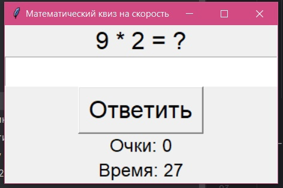
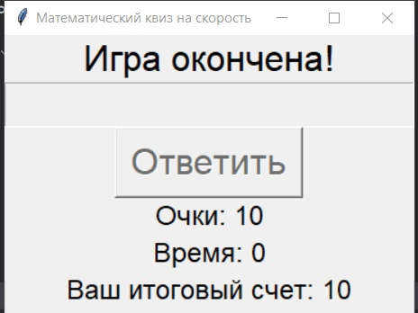

# Математический квиз на скорость

## Описание

"Математический квиз на скорость" - это интерактивная игра, в которой игроки должны быстро решать математические задачи на сложение, вычитание, умножение и деление. У вас есть 30 секунд на то, чтобы набрать как можно больше очков, правильно отвечая на вопросы.

## Установка

1. Скачайте репозиторий с GitHub или GitLab:

   ```bash
   git clone https://github.com/0Soleil0/math-quiz.git
   ```

2. Убедитесь, что у вас установлен Python 
     ```bash
   py --version
   ```
    Если у вас нет tkinter, его можно установить с помощью pip:

   ```bash
   pip install tk
   ```

3. Запустите игру:

   ```bash
   python math_quiz.py
   ```

## Правила

1. У вас есть 30 секунд, чтобы решить как можно больше математических задач.
2. За каждый правильный ответ вы получаете 1 очко.
3. Если вы дадите неверный ответ или не успеете ответить до окончания времени, игра закончится.
4. Постарайтесь набрать максимальное количество очков за отведенное время!

## Управление

- **Введите ответ** в текстовое поле.
- Нажмите кнопку **"Ответить"** или клавишу **Enter**, чтобы проверить ваш ответ.
- В случае неверного ответа или истечения времени игра закончится.

## Скриншоты


